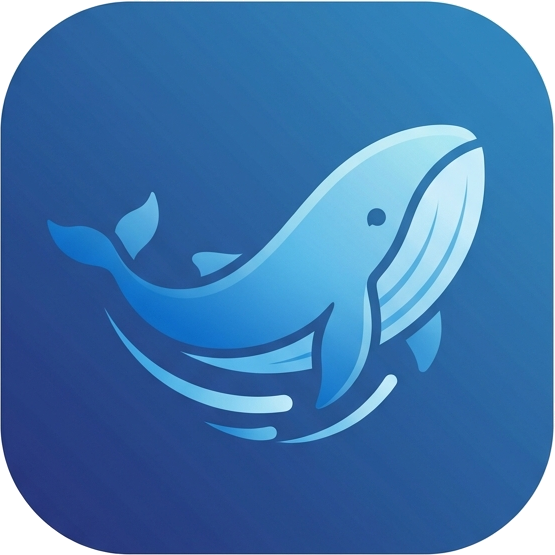

# DSME — DeepSeek Matrix Engine

> An AI-native code editor built with Electron + Vercel AI SDK

<p align="center">
  
</p>

## Features

### 🤖 AI Agent
- **Vercel AI SDK** engine with `streamText` + Zod tool schemas
- 8 built-in tools: `read_file`, `write_file`, `replace_in_file`, `list_directory`, `search_codebase`, `run_command`, `web_search`, `fetch_url`
- Real-time streaming with token-level display
- Multi-step tool chains (up to 25 steps per request)
- Multimodal support (text + image attachments)
- Context window management (50-message sliding window)

### 📝 Code Editor
- Monaco-based editor with 16+ language syntax highlighting
- File tree with git status indicators
- Tab system with dirty indicators and auto-save
- Breadcrumb navigation with click-to-copy path
- Quick Open (⌘P) with fuzzy file search
- Code search across workspace (⌘⇧F)

### 💻 Integrated Terminal
- Embedded terminal with shell access
- Resizable panel with drag handle
- Command output synced from AI agent tool calls

### 🎨 UI/UX
- Dark/Light theme with full CSS variable system
- Tool call inline cards with slide-in animation
- Conversation history with persistence
- Conversation isolation (reset on switch)
- ErrorBoundary on all panels
- macOS native menu + keyboard shortcuts
- Drag-resizable panels (terminal height, chat width)

## Architecture

```
┌─────────────────────────────────────────────────────┐
│                    Electron Main                     │
│  ┌─────────────────────────────────────────────┐    │
│  │            VercelAgent (IAgent)              │    │
│  │  • streamText() with AbortController         │    │
│  │  • Zod-schema tools × 8                      │    │
│  │  • pruneHistory() sliding window             │    │
│  │  • Retry with backoff (max 3)                │    │
│  └──────────────┬──────────────────────────────┘    │
│                 │ IPC                                │
│  chat-stream-{start,token,end} + chat-status        │
│                 │                                    │
│  ┌──────────────┴──────────────────────────────┐    │
│  │           Preload (contextBridge)            │    │
│  └──────────────┬──────────────────────────────┘    │
└─────────────────┼───────────────────────────────────┘
                  │
┌─────────────────┼───────────────────────────────────┐
│  ┌──────────────┴──────────────────────────────┐    │
│  │              React Frontend                  │    │
│  │  App.tsx → 15 components                     │    │
│  │  • ChatPanel (streaming + markdown)          │    │
│  │  • EditorPanel (Monaco)                      │    │
│  │  • FileTree / GitPanel / SearchPanel          │    │
│  │  • TerminalPanel / StatusBar                 │    │
│  └─────────────────────────────────────────────┘    │
│                 Renderer Process                     │
└─────────────────────────────────────────────────────┘
```

## Security

- All 8 `exec()` calls sanitized against shell injection
- URL validation with protocol whitelist (http/https only)
- Shell metacharacter escaping for grep, curl, git
- API keys stored in user data directory, never in source

## Quick Start

```bash
# Install dependencies
npm install

# Development (Vite HMR + Electron)
npm run dev

# Production build
npm run build
```

## Configuration

Set your API key via environment variable or Settings (⌘,):

```bash
export DSME_API_KEY="sk-your-key-here"
```

Compatible with any OpenAI-format API endpoint:
- SiliconFlow (default)
- DeepSeek
- OpenAI
- Any OpenAI-compatible provider

## Keyboard Shortcuts

| Shortcut | Action |
|----------|--------|
| ⌘P | Quick Open |
| ⌘S | Save |
| ⌘B | Toggle Sidebar |
| ⌘L | Focus Chat |
| ⌘, | Settings |
| ⇧⌘L | Toggle Theme |
| ⇧⌘F | Search in Files |
| ⌘? | Keyboard Shortcuts |
| ⌘W | Close Tab |

## Tech Stack

- **Runtime**: Electron 36
- **Frontend**: React 19 + Vite 7
- **AI Engine**: Vercel AI SDK (`ai` + `@ai-sdk/openai`)
- **Schema**: Zod
- **Editor**: Monaco Editor
- **Markdown**: marked + highlight.js

## License

MIT
