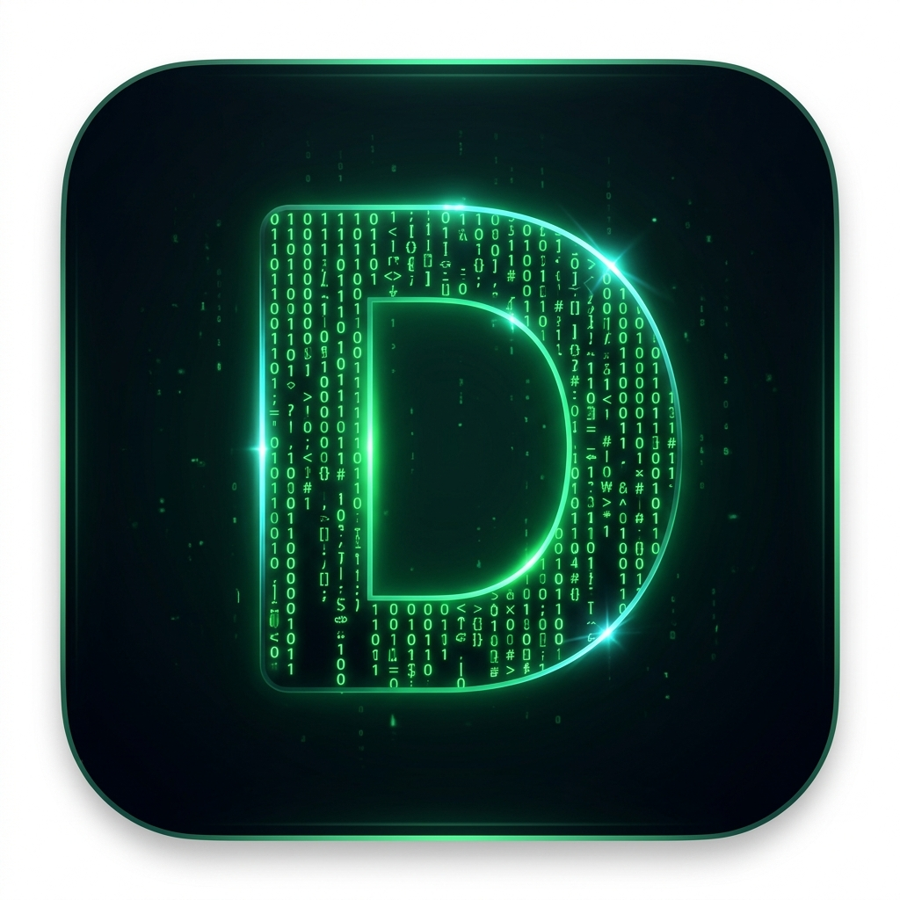

# DSME — DeepSeek Matrix Engine

<p align="center">
  
</p>

<p align="center">
  <a href="README.md">English</a> | <strong>简体中文</strong>
</p>

<p align="center">
  <a href="https://github.com/student2028/dsme/actions/workflows/ci.yml"></a>
  <a href="LICENSE"></a>
  
  
</p>

---

## 项目简介

**DSME（DeepSeek Matrix Engine，深度求索矩阵引擎）** 是一款**本地开源的 AI 网页自动化智能体**。它将对话式 AI 与真实的嵌入式 Chromium 浏览器整合在同一款 Electron 桌面应用中。你用自然语言描述目标，智能体便会规划步骤、打开页面、点击元素、填写表单、提取数据、读取文件，并在本机执行 shell 命令——整个过程可在浏览器面板中实时观看。

与通过 WebSocket 远程驱动 Puppeteer/Playwright 的方案不同，DSME **通过 Electron 原生能力直接控制浏览器**：用 `WebContentsView` 渲染页面，用 `sendInputEvent` 模拟点击与按键，用 CDP 无障碍快照生成元素引用（`[e1]`、`[e2]` …），并可直接访问会话与 Cookie。这意味着更低延迟、可持久保持登录态，且你随时可以在 UI 中手动介入。

DSME 面向开发者与进阶用户，提供一位**能操作网页的 AI 助手**——研究资料、填表、导出仪表盘、从 SPA 抓取 API 数据、复用 Cookie 登录态——而无需单独搭建无头浏览器集群。

## 为什么选择 DSME？

| | 常见无头自动化方案 | DSME |
|---|---|---|
| 浏览器 | 外部进程，常为无头模式 | 内嵌面板，可见且可手动操作 |
| 输入方式 | 通过 CDP 注入合成 DOM 事件 | Electron 原生输入 + CDP 快照 |
| 会话 | 每次运行常需冷启动 | 持久化分区；macOS 支持同步 Chrome Cookie |
| AI 集成 | 需自行拼接 LLM 与工具链 | 内置智能体，含 30+ 浏览器工具及文件/搜索/shell 能力 |
| 模型绑定 | 因方案而异 | 兼容任意 OpenAI 格式 API（DeepSeek、火山方舟、SiliconFlow、Google 等） |

## 典型使用场景

- **研究与内容提取** — 浏览网站，基于 Readability 提取正文，捕获 SPA 的网络 API 响应。
- **需登录的工作流** — macOS 同步 Chrome Cookie，或导入/导出 Cookie JSON 恢复会话。
- **多步骤网页任务** — 具名浏览器任务时间线，支持 Markdown 导出；快照/恢复状态可回滚误操作。
- **本地开发助手** — 在同一窗口中读写项目文件、搜索代码库、运行命令并浏览文档。
- **表单与文件自动化** — 按元素引用输入、无系统对话框上传文件、导出 PDF、管理下载。

## 功能特性

### 浏览器自动化（核心）

- 内嵌 Chromium 面板，支持 **Electron 原生输入**（`sendInputEvent`、`insertText`）与 **CDP 无障碍快照**（`[e1]`、`[e2]` 引用）
- 30+ 个 `browser_*` 工具：导航、快照、点击、输入、滚动、iframe 切换、网络捕获、PDF 导出、Cookie 导入/导出、状态回滚、元素高亮
- UI 中的**浏览器任务时间线** — 多步骤会话，可导出 Markdown
- 内置 **Userscript**（Tampermonkey 风格）及管理界面

### AI 智能体

- **Vercel AI SDK** 内核（`streamText` + Zod 工具）与可选 **Builtin** 内核（直连 OpenAI 兼容 API）
- 工具：`web_search`、`fetch_url`、`read_file`、`write_file`、`replace_in_file`、`list_directory`、`search_codebase`、`run_command`、`browse_page`，以及全部 `browser_*` 工具
- 流式输出、多模态输入（粘贴/拖拽图片）、对话持久化、中止/重试
- 可插拔提供商：火山方舟、SiliconFlow、Google、DeepSeek（任意 OpenAI 兼容端点）

### 用户体验

- 分栏布局：可调整宽度的浏览器 + 聊天面板
- 深色/浅色主题、快捷键、设置面板、错误边界
- macOS：Chrome Cookie 同步，便于使用已登录会话

## 架构

```
┌─────────────────────────────────────────────────────────────┐
│                     Electron 主进程                          │
│  ┌──────────────────┐  ┌─────────────────────────────────┐  │
│  │ BrowserViewManager│  │ VercelAgent / BuiltinAgent (IAgent)│
│  │ WebContentsView   │◄─┤ streamText + 工具 + shared-tools  │  │
│  │ CDP + 原生 I/O    │  └──────────────┬──────────────────┘  │
│  └────────▲─────────┘                 │ IPC                  │
│           │ 显示/隐藏/边界               ▼                      │
│  ┌────────┴─────────┐  ┌─────────────────────────────────┐  │
│  │ preload（桥接）    │  │ React：BrowserPanel + ChatPanel  │  │
│  └──────────────────┘  └─────────────────────────────────┘  │
└─────────────────────────────────────────────────────────────┘
```

## 安全模型

DSME 是**本地自动化工具**：AI 可在你的机器上执行 shell 命令并控制浏览器。

| 控制项 | 行为 |
|--------|------|
| 渲染进程 | `contextIsolation: true`，`nodeIntegration: false` |
| 浏览器视图 | `sandbox: true`，独立会话分区 |
| `run_command` | 对明显破坏性命令有黑名单（如 `rm -rf /`、`mkfs`）— **并非**完整沙箱 |
| 下载 | 文件名经 `path.basename`  sanitize |
| Markdown | 聊天内容经 DOMPurify 消毒 |
| CDP 代理 | 仅绑定 **127.0.0.1**（默认端口 `9418`） |
| API 密钥 | 存于 Electron `userData`，不会提交到 git |

漏洞报告请参阅 [SECURITY.md](./SECURITY.md)。

## 环境要求

- **Node.js** 20+（推荐 22+）
- **macOS** 方可使用 Chrome Cookie 同步（其他平台浏览器功能正常，Cookie 同步返回不支持）
- 一个 OpenAI 兼容提供商的 API 密钥

## 快速开始

```bash
git clone https://github.com/student2028/dsme.git
cd dsme
npm install
npm run dev
```

通过**设置（⌘,）**或环境变量配置 API 密钥：

```bash
export DSME_API_KEY="sk-..."           # SiliconFlow
export VOLCENGINE_API_KEY="..."        # 火山方舟（默认提供商）
export DEEPSEEK_API_KEY="..."
export GOOGLE_API_KEY="..."
```

构建 macOS 应用包：

```bash
npm run build:pkg
```

## 脚本命令

| 命令 | 说明 |
|------|------|
| `npm run dev` | Vite 热更新 + Electron |
| `npm run build` | 类型检查 + 生产构建 |
| `npm run build:pkg` | 构建 + electron-builder 打包 DMG（macOS） |
| `npm run typecheck` | `tsc --noEmit` |
| `npm run lint` | ESLint（要求零错误） |
| `npm run test:unit` | 纯 Node 单元测试（无需 Electron） |
| `npm run test:smoke` | CDP 冒烟测试（需先启动应用） |
| `npm run test:ci` | typecheck + lint + 单元测试 + 构建（CI 默认） |

## 测试

**单元测试**（CI）：

```bash
npm run test:ci
```

**冒烟测试**（手动 / 可选）：

1. 启动应用：`npm run dev`
2. 运行：`npm run test:smoke`  
   通过 `127.0.0.1:9418` 连接 CDP（可用 `DSME_CDP_PORT` 覆盖）。

## 键盘快捷键

| 快捷键 | 操作 |
|--------|------|
| ⌘N | 新建对话 |
| ⌘F | 在对话中查找 |
| ⌘L | 聚焦聊天输入框 |
| ⌘, | 设置 |
| ⌘? | 快捷键帮助 |
| Enter | 发送消息 |
| ⇧Enter | 换行 |

## 项目结构

```
electron/
  agents/          # IAgent 内核 + 共享工具
  browser-view-manager.ts
  config/          # 提供商预设 + 用户配置持久化
  lib/             # 错误处理、命令守卫、run_command 辅助
src/
  components/      # React UI
  lib/             # browserTaskTimeline（纯函数）
tests/             # unit.mjs + smoke.mjs
```

## 参与贡献

请参阅 [CONTRIBUTING.md](./CONTRIBUTING.md)。

## 许可证

MIT — 详见 [LICENSE](./LICENSE)。

## 更新日志

详见 [CHANGELOG.md](./CHANGELOG.md)。
